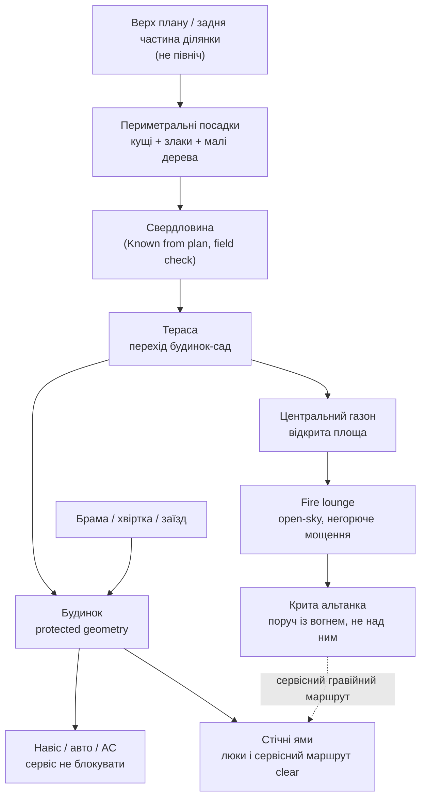

# Схематичний план ландшафту

Дата: 2026-07-01  
Статус: ПОМИЛКОВА ЧЕРНЕТКА / НЕ ВИКОРИСТОВУВАТИ ЯК ПЛАН  
Пов'язаний документ: `01_Landscape_Master_Concept.md`

## Важлива правка

Цей файл і SVG-схема `02_Landscape_Schematic_Plan.svg` виявилися просторово ненадійними. Вони змішали орієнтацію плану, реальні зони ділянки і концептуальні припущення.

Не використовувати цей файл для:

- розташування fire-зони;
- розташування критої альтанки;
- маршруту доріжок;
- сервісного доступу до свердловини / стічних ям;
- посадок, поливу, світла або кошторису.

Залишено тільки як зафіксовану невдалу чернетку, щоб не повторювати ту саму помилку. Наступну схему треба будувати поверх реального плану / Figma / розмітки, а не від руки.

## Обмеження схеми

Ця схема показує логіку зон, а не точні розміри.

Не вказано свідомо:

- північ і сонячний шлях, бо орієнтація Missing;
- точні ухили і дренажні стрілки, бо рівні/стік води Missing;
- точні відступи fire-зони, альтанки і дерев, бо потрібні геодезія, сервісні точки і локальні правила;
- точні кількості рослин, бо потрібні ґрунт, полив, освітленість і дорослі габарити.

## Візуальна схема

## Mermaid-схема зон

## Маршрути

| Маршрут | Логіка | Покриття | Перевірити |
| --- | --- | --- | --- |
| Брама / хвіртка -> вхід | щоденний основний шлях | суцільні плити/бруківка на морозостійкій основі | ширина, ухил, очищення снігу, кабелі під покриттям |
| Тераса -> fire lounge | садова прогулянкова вісь | великі плити в газоні або з гравійними швами | крок, зручність косіння, світло без "аеропорту" |
| Fire lounge -> альтанка | короткий lounge-зв'язок | ті самі плити або спільна тверда зона | безпека біля вогню, меблі, відстані |
| Сервісний маршрут | доступ до свердловини, стічних ям, водостоків, AC | гравій або прості плити в гравії | не перекрити люки, не садити великі кущі на трасі |

## Розкладка зон

| Зона | Рекомендована позиція на схемі | Чому так | Що блокує фінальне рішення |
| --- | --- | --- | --- |
| Центральний газон | між терасою і задніми зонами | дає чистий простір і дорогий спокійний вигляд | ґрунт, полив, рівні, бажаний догляд |
| Fire lounge | у задньому саду як окрема open-sky площадка | вогонь стає точкою призначення, не заважає дому | відступи, дренаж, комунікації, тип вогню |
| Крита альтанка | поруч із fire lounge, але не над полум'ям | можна сидіти в дощ/тінь, але без ризику диму/жару під дахом | межі, вода з даху, сценарій використання, електрика |
| Периметр | мікс кущів, злаків, малих дерев | приватність, сезонність, м'якість | північ/сонце, дорослі габарити, полив |
| Сервісні зони | гравійні практичні проходи | не жертвуємо доступом заради декору | точні люки, свердловина, водостоки, кабельні траси |

## Конфлікти і рішення

| Конфлікт | Рекомендація | Чому | Що перевірити |
| --- | --- | --- | --- |
| Красива кругла fire-зона vs сервісні люки/свердловина | Fire-зону ставити тільки після розмітки сервісних доступів | доступ до інфраструктури важливіший за форму | люки, свердловина, траншеї, межі |
| Альтанка з вогнем під дахом vs безпека | Вогонь open-sky, альтанка поруч | менше ризику диму, жару, пожежі і складної вентиляції | тип вогню, відступи, матеріали, локальні правила |
| Premium lawn vs піщаний/сухий ґрунт | Газон робити тільки з підготовкою ґрунту і поливом | інакше буде плямами й бур'янами | ґрунт, полив, рівні, догляд |
| Гортензії/рододендрони vs невідоме сонце/ґрунт | Гортензії як базова тема, рододендрони тільки в підготовленій кислій напівтіньовій зоні | менше ризику втратити дорогі рослини | pH, тінь, вода, мульча |

## Наступний практичний крок

Роздрукувати або відкрити SVG-схему на телефоні і на ділянці розмітити:

1. приблизний центр fire lounge;
2. прямокутник альтанки;
3. межу центрального газону;
4. крокову доріжку від тераси;
5. сервісний маршрут до свердловини і стічних ям.

Після цього сфотографувати розмітку з 2-3 точок. Тоді можна зробити наступну версію схеми вже ближче до реального плану.
