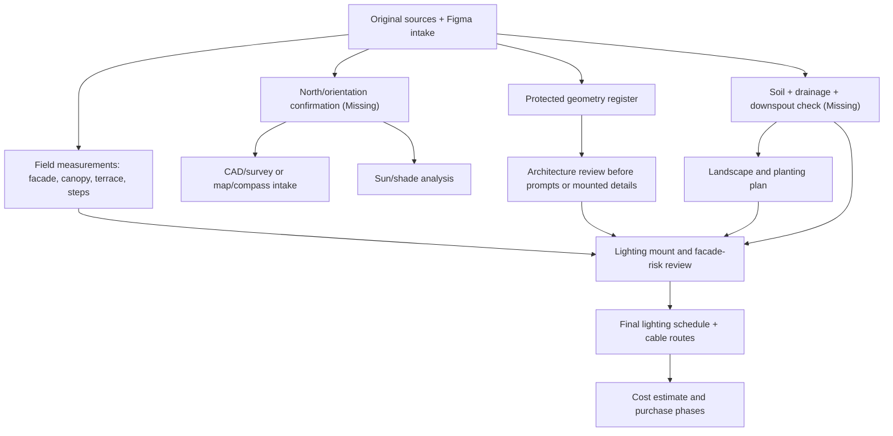

# House Sudova Task Plan

Date: 2026-07-01  
Current goal: confirm north/CAD/survey source path and collect field measurements before detailed lighting-document edits or purchase calculations.

## Scope

Included:

- Source inventory for raw photos, annotated views, plans/drawings, Figma node `8:154`, references, and existing lighting/design docs.
- Known / observed / user-provided / missing fact register.
- Protected geometry register.
- Reference style intake.
- Conflict register and open questions.
- North/CAD/survey intake checklist.
- Field-measurement checklist for front facade, canopy, terrace, stairs, AC/service, drainage, and electrical coordination.

Not included yet:

- Final landscape plan.
- Final lighting schedule.
- Plant schedule.
- Cost estimate.
- Construction drawings.
- Electrical approval.

## Current Status

| Step | Status | Notes |
| --- | --- | --- |
| Inventory local originals and docs | Done | `Materials`, `Exterior_Lighting_Project`, local skills reviewed. |
| Inspect Figma plan | Done | Read-only extraction from node `8:154`. |
| Inspect plan/drawing images | Done | Key dimensions and conflicts recorded. |
| Inspect representative raw photos | Done | Protected geometry and risks recorded. |
| Inspect reference style | Done | Mood accepted, conflicts filtered. |
| Create source register | Done | See `planning/source-register.md`. |
| Create open questions | Done | See `planning/open-questions.md`. |
| Cross-link main lighting README | Done | `Exterior_Lighting_Project/00_README.md` now points to the source register. |
| Check for local CAD/survey-type files | Done | No `.dwg`, `.dxf`, `.ifc`, `.skp`, `.rvt`, `.pdf`, `.pln`, `.step`, or `.stp` files found. |
| Create north/CAD/survey intake | Done | See `planning/orientation-survey-intake.md`. |
| Create field-measurement checklist | Done | See `planning/field-measurement-checklist.md`. |
| Resolve small house/terrace dimension variances | Done | 12.720 m house facade and 6.30 x 3.05 m terrace envelope are now coordination values; field measurement still required before purchases. |
| Resolve canopy neon N2 segmentation | Done | 12.645 m Figma length now uses planning segmentation 3 x ~4.215 m / rounded 3 x ~4.22 m; final cut still requires electrician/product verification. |
| Update detailed existing lighting docs | Pending | Wait for owner confirmation to avoid turning draft notes into approved construction-facing docs. |

## Dependencies Before Final Design

## Priority Logic

| Priority | What belongs here | Current note |
| --- | --- | --- |
| Must-have | Geometry preservation, drainage/grade checks, AC access, electrical safety, field measurements | Not complete until owner/contractor checks missing facts. |
| Should-have | Coordinated warm exterior material/lighting direction, restrained 2700K scenes, cable sleeves before hardscape | Concept exists; needs technical routing. |
| Nice-to-have | Additional garden uplights, decorative plant accents, advanced HA scenes | Figma has many candidates, but not final. |
| Later | Full cost estimate, purchase-ready BOM, final plant schedule, polished report | Wait until quantities/specs are verified. |

## Conflict Resolution Summary

Recommended path:

1. Use `planning/source-register.md` as the current coordination register.
2. Treat Figma dimensions as planning values, not final purchase measurements.
3. Treat plan/drawing photos as reliable source evidence, but not a substitute for original CAD or field measurements.
4. Treat references as mood, not geometry or temperature specs.
5. Keep all visible references within House Sudova rules: preserve roof/windows/doors/columns/walls/AC, use 2700K, avoid continuous roof outlines.
6. Use `planning/orientation-survey-intake.md` and `planning/field-measurement-checklist.md` before revising detailed lighting schedules, BOMs, or estimates.
