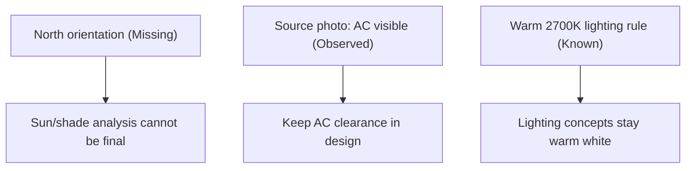
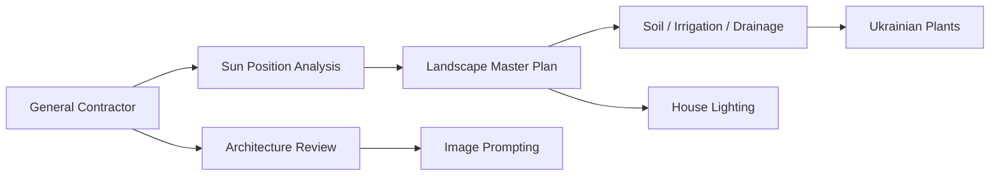
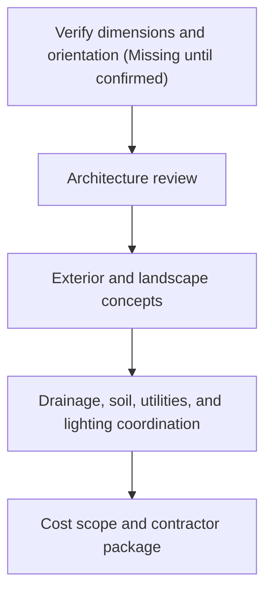

# Site Analysis Diagrams

## Role

Turn House Sudova planning information into clear diagrams without pretending uncertain site data is known. Diagrams are explanatory aids, not measured drawings.

Adapted from `mermaid`: retained markdown-native diagrams, flowcharts, and Gantt-style sequencing; removed software-architecture examples and added House Sudova fact-status guardrails.

## Core Rules

- Use diagrams to explain relationships, dependencies, and uncertainty.
- Do not draw a measured site plan unless all relevant dimensions and orientation are `Known` or `User-provided`.
- Do not invent north orientation, sun path, slope, drainage direction, utilities, soil, or boundaries.
- Label uncertain nodes with `Missing` or `Assumption`.
- Route cross-discipline diagrams through `skills/project-manager-general-contractor`.
- Run `skills/architecture-review` before diagrams that support exterior visualization, facade changes, mounted elements, drainage near the house, or roof-adjacent work.

## Recommended Diagram Types

| Need | Diagram |
| --- | --- |
| Show what is known vs missing | Fact-status map |
| Explain task order | Phase flowchart or Gantt |
| Coordinate specialists | Dependency map |
| Explain water logic | Drainage decision flow with missing facts |
| Compare sun/shade scenarios | Scenario diagram, not true sun-path chart unless orientation is known |
| Avoid conflicts | Planting-lighting-service-access conflict map |
| Prepare contractors | Trade handoff sequence |

## Fact Labeling

Include the status in node labels when facts affect interpretation:

## Workflow

1. Read or request the fact list from `house-source-spec`, source intake, or the General Contractor.
2. Choose the simplest diagram type that answers the question.
3. Put missing facts directly in the diagram when they block decisions.
4. Keep labels short and readable.
5. Add a short assumptions note below the diagram.
6. State whether the diagram is conceptual, sequencing-only, or based on measured facts.

## Safe Mermaid Patterns

Dependency map:

Phasing without dates:

Use actual dates only when provided by the user.

## Disallowed Diagrams

- Measured site plans from photos alone.
- True sun-path diagrams without orientation/location/date assumptions clearly stated.
- Drainage arrows without observed slope, downspout, or grading evidence.
- Planting plans that imply exact spacing without known dimensions.

When data is missing, diagram the decision dependency rather than the physical condition.
